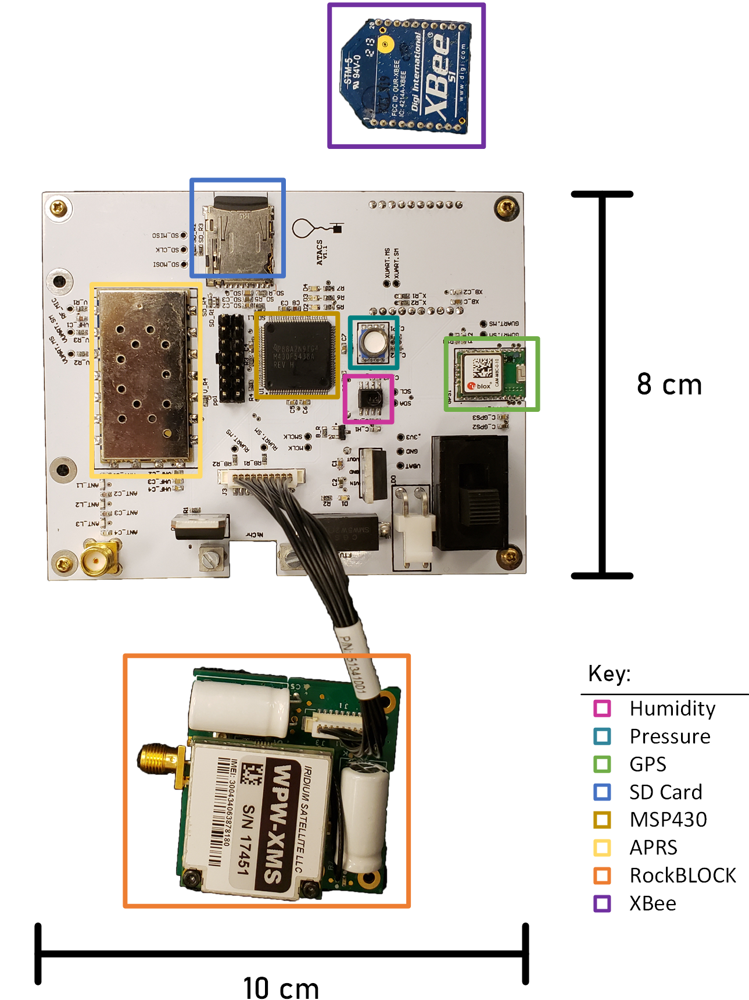

# ATACS
*the* Aerial Termination And Communication System

A global-range, two-way communication system for high-altitude balloons that enables reliable telemetry beaconing and on-demand flight termination.

## Subdirectories
* [Hardware](./hardware/README.md)
* Software
    * [Ground Station](./software/groundstation/README.md)
    * [RTOS](./software/rtos/README.md)

