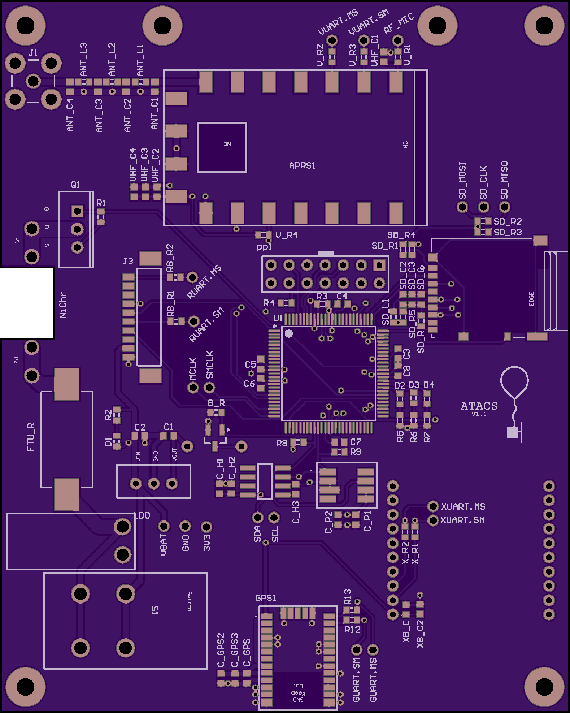
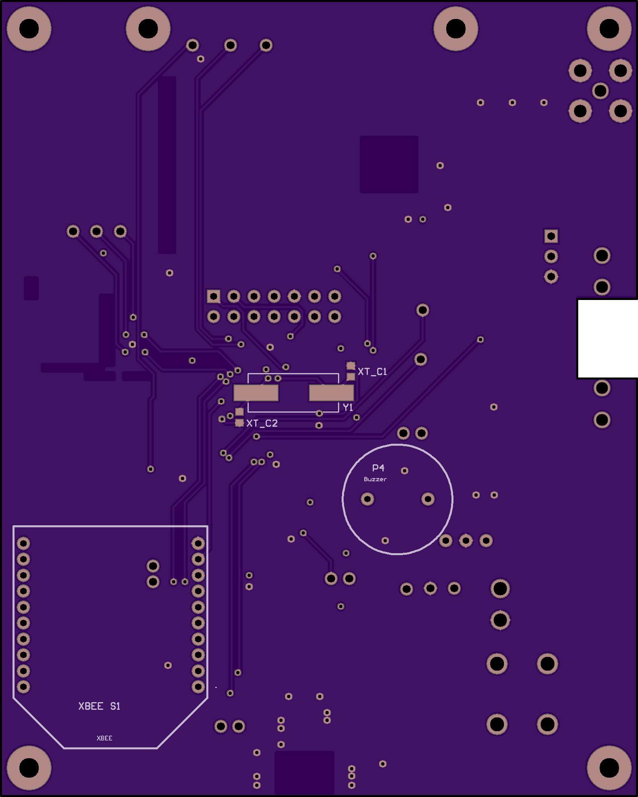

# ATACS hardware
Only tested in Altium 17, but should work in any version >=17. 

Simply open `board/ATACS.PrjPcb` in Altium and enjoy!

[Order a populated board on CircuitHub](https://circuithub.com/projects/MBuRST/atacs2/revisions/24389)

## Board Preview
**Top**

**Bottom**

